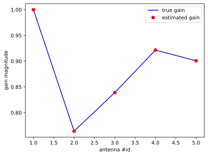

# Redundancy calibration
Redundancy calibration is a method of calibrating a radio telescope that has multiple redundant baselines. It has the advantage of being a single-step procedure. Stefan Wijnholds made a small introduction script in Matlab to demonstrate the technique. This is a Python translation of that script.

``` {.python #imports}
import numpy as np
from numpy import matrix
from matplotlib import pyplot as plt
from pathlib import Path

def diag(x):
    return np.asmatrix(np.diag(x))
```

## Simple demonstration of redundancy calibration for QC project
>
> This script provides a simple demonstration of redundancy calibration
> using a 5-element uniform linear array. It uses conventional redundancy
> calibration based on the logarithm of the elements of the measured array
> covariance matrix (the visibilities) as that allows to estimate the gain
> magnitudes and phases directly without resorting to iterative estimateion
> of the true values of the measured visibilites and the gains. The latter
> approach is more robust to low-SNR scenarios, but is more complicated and
> therefore less suitable for the initial exploration of QC approaches to
> radio interferometric calibration. Both implementations of redundancy
> calibration are described in [1].
>
> The basic idea of redundancy calibration is that identical baselines
> should measure the same visibility. For a 5-element uniform linear array,
> there are 3 distinct types of redundant baselines:
>
> ~~~
> array configuration   x   x   x   x   x
> baseline type 1        <-> <-> <-> <->
> baseline type 2        <-----> <----->
>                            <----->
>                                <----->
> baseline type 3        <--------->
>                            <--------->
> ~~~
>
> Each element of the array covariance matrix is a product of two gains and
> the unperturbed value of the corresponding visibility. Conventional
> redundancy calibration takes the logarithm to transform this product of
> factors into a summation of terms, resulting in a very simple linear
> relationship with a sparse measurement matrix.
>
> Reference
> [1]   Stefan J. Wijnholds and Parisa Noorishad, "Statistically optimal
> self-calibration of regular imaging arrays", European Signal Processing
> Conference (EuSiPCo), 2012.
>
> Stefan J. Wijnholds, October 7, 2021

## Simulation setup
> antenna positions in m of 5-element uniform linear array as column vector
``` {.python #setup}
xpos = np.linspace(-2, 2, 5)[:,None]
```
### number of antennas
> Hardcoded as the measurement matrix will be hardcoded for this example as
> well, so we want to trigger an error when an inconsistent simulation
> setup is defined.
``` {.python #setup}
n_ant = 5
```
### source positions as column vector of directional cosines
> A 3-source model is used to ensure that different baselines have
> different true visibilities. This may not be true for a 1-source model.
``` {.python #setup}
l = np.r_[-0.5, 0.2, 0.7]
```

### source powers as column vector
``` {.python #setup}
sigma = np.r_[0.8, 1, 0.4]
```

> ### gain column vector
> This is what we like to estimate.
``` {.python #setup}
# g = 1 + 0.3 * (randn(Nant, 1) + 1i * randn(Nant, 1));
g  = 1 + 0.3 * (np.random.normal(size=n_ant) \
         + 1j * np.random.normal(size=n_ant))
```

### geometrical delays of source signals over the array
``` {.python #setup}
freq = 150e6    # measurement frequency in MHz
c = 2.99792e8   # speed of light in m/s
A = np.matrix(np.exp(-(2 * np.pi * 1j * freq / c) * (xpos * l)))
```

### noise-free "measured" visibilities
``` {.python #setup}
R = diag(g) @ A @ diag(sigma) @ A.H @ diag(g).H
```
The original code transposed the last `diag(g)`, which is strictly speaking
correct but a bit futile, let's keep it here too.

## Perform redundancy calibration of gain magnitudes

### measurement matrix for gain magnitudes
``` {.python #gain-magnitudes}
Mmag = np.matrix(
    [[1, 1, 0, 0, 0, 1, 0, 0],     # baseline type 1 (4 rows)
     [0, 1, 1, 0, 0, 1, 0, 0],
     [0, 0, 1, 1, 0, 1, 0, 0],
     [0, 0, 0, 1, 1, 1, 0, 0],
     [1, 0, 1, 0, 0, 0, 1, 0],     # baseline type 2 (3 rows)
     [0, 1, 0, 1, 0, 0, 1, 0],
     [0, 0, 1, 0, 1, 0, 1, 0],
     [1, 0, 0, 1, 0, 0, 0, 1],     # baseline type 3 (1 row)
     [0, 1, 0, 0, 1, 0, 0, 1],
     [1, 0, 0, 0, 0, 0, 0, 0]])    # magnitude constriant
```
I can see how this encodes the information we need: the combination of each antenna together with the baseline type. These are two different bits of information, why are they in the same matrix?

> This measurement matrix applies to the elements in the upper triangle of
> the array covariance matrix to which redundancy is applicable. The
> following selection matrix selects the appropriate elements from the
> array covariance matrix
``` {.python #gain-magnitudes}
# sel = np.c_[6, 12, 18, 24, 11, 17, 23, 16, 22].T - 1
sel = [i + j * n_ant + j             # indexing row-major
       for i in range(1, n_ant - 1)  # from first off-diagonal
                                     # not including the corner element
       for j in range(n_ant - i)]    # the first off-diagonal has (n_ant - 1) elements
                                     # and continuing, one less each time
```
These are the flat indices into the upper triangle, counting from (not including) the diagonal up. Each element in array `R` is the visibility between two antenas. This just happens to be the order in which the baselines appear in matrix `Mmag`. The largest baseline is not in there, since it is not redundant. We add a `-1` for 0 based indexing. In Python, these numbers actually give the lower triangle. The above lines compute the correct numbers in Python for any array size `n_ant`.

### solve for gain magnitudes
``` {.python #gain-magnitudes}
theta = np.linalg.lstsq(Mmag, np.c_[np.log10(np.abs(R.flat[sel])), 0].T, rcond=None)
gmag = 10**np.asarray(theta[0])[:n_ant]
```

``` {.python file=scripts/plot-1.py figure=fig/plot-1.svg}
<<imports>>
<<setup>>
<<gain-magnitudes>>

# Normalise true gain values to match constraint that the gain of the first
gmag_true = abs(g) / abs(g.flat[0])
fig, ax = plt.subplots(1, 1)
antennae = np.arange(1, n_ant+1)
ax.plot(antennae, gmag_true, 'b-', label='true gain')
ax.plot(antennae, gmag, 'ro', label='estimated gain')
ax.set_xlabel('antenna #id')
ax.set_ylabel('gain magnitude')
ax.legend()
Path("fig").mkdir(exist_ok=True)
fig.savefig("fig/plot-1.svg", bbox_inches='tight')
```



## perform redundancy calibration of gain phases

### measurement matrix for gain phases
``` {.python #gain-phases}
Mph = np.array([
     [1, -1,  0,  0,  0,  1,  0,  0],   # baseline type 1 (4 rows)
     [0,  1, -1,  0,  0,  1,  0,  0],  
     [0,  0,  1, -1,  0,  1,  0,  0],  
     [0,  0,  0,  1, -1,  1,  0,  0],  
     [1,  0, -1,  0,  0,  0,  1,  0],   # baseline type 2 (3 rows)
     [0,  1,  0, -1,  0,  0,  1,  0],  
     [0,  0,  1,  0, -1,  0,  1,  0],  
     [1,  0,  0, -1,  0,  0,  0,  1],   # baseline type 3 (1 row)
     [0,  1,  0,  0, -1,  0,  0,  1],  
     [0,  0,  1,  0,  0,  0,  0,  0],   # phase constraint on first element
     np.r_[xpos.flat, 0, 0, 0]])             # phase gradient constraint
```

### solve for gain phases
``` {.python #gain-phases}
theta = np.linalg.lstsq(Mph, np.c_[np.angle(R.flat[sel]), 0, 0].T, rcond=None)
gph = theta[0][:n_ant]
```

``` {.python file=scripts/plot-2.py figure=fig/plot-2.svg}
<<imports>>
<<setup>>
<<gain-magnitudes>>
<<gain-phases>>

gph_true = np.c_[np.angle(g) - np.angle(g[2])]
theta = np.linalg.lstsq(xpos, gph_true - gph, rcond=None)
gph_true = gph_true - np.asarray(theta[0]) * xpos

fig, ax = plt.subplots(1, 1)
antennae = np.arange(1, n_ant+1)
ax.plot(antennae, gph_true, 'b-', label='true gain')
ax.plot(antennae, gph, 'ro', label='estimated gain')
ax.set_xlabel('antenna #id')
ax.set_ylabel('gain phases (rad)')
ax.legend()
Path("fig").mkdir(exist_ok=True)
fig.savefig("fig/plot-2.svg", bbox_inches='tight')
```


``` {.matlab}
gph_true = angle(g) - angle(g(3));
% find (arbitrary) phase gradient ambiguity
theta = xpos \ (gph_true - gph);
% correct true gains for this gradient ambiguity
gph_true = gph_true - theta * xpos;
plot(1:5, gph_true, 'b-', 1:5, gph, 'ro');
set(gca, 'FontSize', 16);
xlabel('antenna index');
ylabel('gain phases (rad)');
legend('true gain', 'estimated gain');
```

# Potential Quantum implementation
This algorithm can potentially be implemented for a quantum computer. We performed two least-squares fits for phase calibration and one for the amplitudes. The HHL algorithm could give a speedup here.

## HHL
This algorithm by Harrow, Hassidim, and Lloyd (HHL09) solves a linear system. In the case of non-hermitian/non-square matrices, what it computes is the Moore-Penrose pseudo-inverse, which is exactly what we want.

According to the Qiskit documentation, the best you can do on a classical computer for *$s$-sparse* systems (at most $s$ non-zero entries per row) is $O(Ns\kappa\log(1/\epsilon))$, where $\kappa$ is the condition number of the system, $\epsilon$ is the accuracy required, and most importantly $N$ is the number of rows (number of linear equations) in the system.

Quantum HHL runs in $O(\log(N)s^2\kappa^2/\epsilon), however this comes with a major caveat. The resulting vector exists only as a quantum state. The only thing we can get out is a projection of the solution vector onto a scalar. The conclusion is that we can be faster than the best classical algorithm, as long as we don't need the entire solution. How does this work out for the redundancy calibration?

## RedCal and HHL time-complexity
First get $s$ out of the way: we have systems where $s = 3$, so as a constant factor it can drop out of our considerations. Let us have an array of $N$ antennae, $B = N(N-1)/2$ baselines and $R$ unique (non-redundant) baselines. The calibration improves in quality if we have redundant baselines with a large multiplicity $m$, such that $B \approx R m$. The linear systems we have to solve will be of size $(N + R) \times (B + 1)$ (the $+1$ is the last constraint row). We are only interested however in the $N$ terms for each of our antennae. Since we need to run HHL $N$ times, we scale as $O(N \log B) \sim O(N \log N)$.
The best known classical algorithm needs $O(B) \sim O(N^2)$ to solve the same system.

## Number of q-bits
<!-- 
In an ideal case, we can have for $N$ antennas, $N(N-1) / 2$ individual baselines and $N(N-1) / 4$ redundant baselines. Then we get a system of size $(N + N(N-1)/4) x N(N-1)/2$ with a sparsity of $s=3$. Solving this classically would scale as $O(N^2)$ whereas the quantum HHL algorithm can solve it in $O(\log(N))$. Since we need to read out $N$ elements of the solution, we get $O(N\log(N)))$, which is still better for large $N$.


In the case of a linear equidistant array, the number of redundant baselines is $N-2$, so that is not good enough.

In the case of a square equidistant array, there are two diagonal baselines that are not redundant, among $2x(x-1)$ total baselines. Having $x^2$ antennas and $2x(x-1) - 2$ redundant baselines, both scaling as $x^2$, we still don't gain any efficiency from the quantum algorithm. Suppose however that we have two identical ideal arrays that individually have no redundant baselines (each of size $x$, each having $x(x-1)/2$ baselines). Then the total number of baselines is $x(x-1)/2 + 1$ (the added baseline from the distance between the two arrays) and the number of antennas is $2n$, then we're in buisiness.
-->