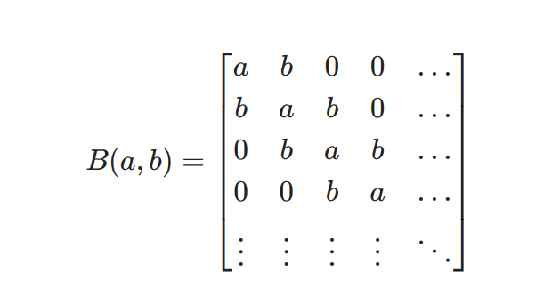

# Using HHL for Redundancy Calibration

## Contents

- [An exploratory notebook](./hhl_exploratory.ipynb), showing what we tried and how it worked.
- [A minimal version](./hhl_minimal.ipynb) of the document above, going directly to our best solution. This document is less transparent, and it was written for sending a simple calculation to qIBM servers.

## Conclusions

### TL;DR

After our preliminary analysis, we found the HHL algorithm is not the most promising choice for our needs.

---
### Details

Some conclusions:

The HHL algorithm presents some relevant limitations for us. Such as:

- Its results are approximate for matrices larger than $2x2$.
- It cannot discriminate the positive from the negative elements in the solution vector.

But the most important, by far, is the following:

- HHL, or at least its current `qiskit` implementation, only allows extracting either <x|x>, the arithmetic average of |x>'s coefficients or <x|B|x>. The last one looks promising, but unfortunately B is not a generic matrix: it has to be a Toeplitz tridiagonal matrix with only two degrees of freedom (see image below). Other subcases than those seem to be deliberately not implemented, probably because they don't offer any computational advantage compared to other methods. Furthermore, the whole method is known for not returning a complete solution.

### A Toeplitz tridiagonal matrix

For even more details, take a look at [this notebook](./hhl_exploratory.ipynb).